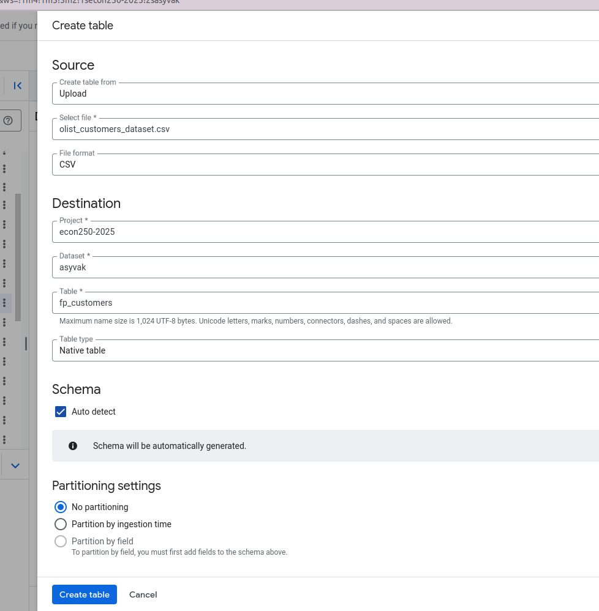
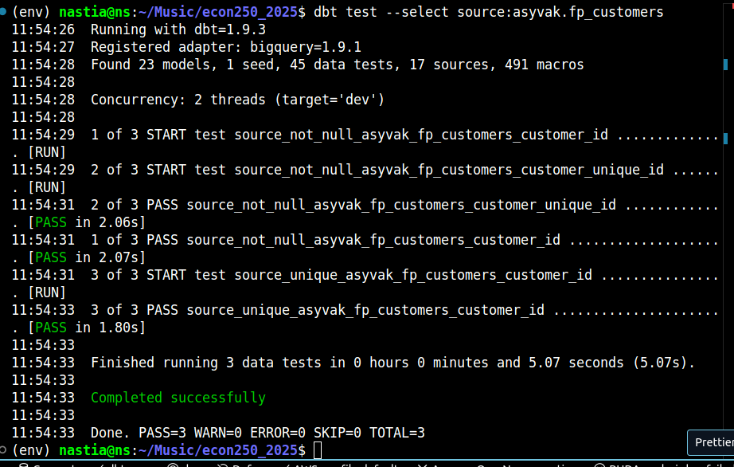
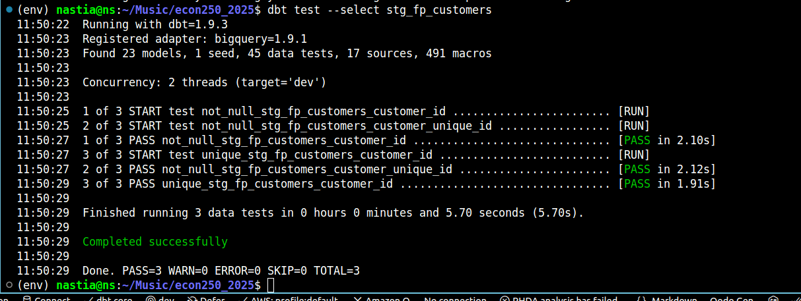
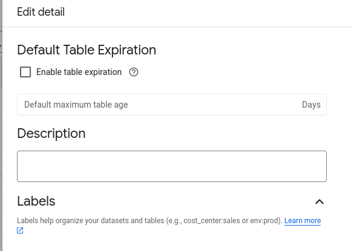
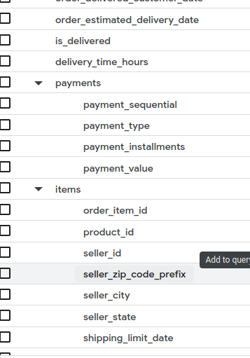

Welcome to your new dbt project!

# Installation

The following tutorial assumes you're already familiar with git and command line usage.

## Getting the code to your local machine
1. Fork this github repository into your local account

2. Copy it to your local machine: `git clone https://github.com/your_account_name/econ250_2025.git`


## gcloud authentication

To run queries from your command line, you'll first need to install `gcloud` utility.

Follow the instructions here: https://cloud.google.com/sdk/docs/install. After installation you should have `gcloud` command available for running in the terminal.

Now, try to authenticate with your **kse email** using the following command: 

```bash
gcloud auth application-default login \
  --scopes=https://www.googleapis.com/auth/bigquery,\
https://www.googleapis.com/auth/drive.readonly,\
https://www.googleapis.com/auth/iam.test,\
https://www.googleapis.com/auth/cloud-platform
```

Now, when you run the following commands something similar should be response: 

```bash
$ gcloud auth list

     Credentialed Accounts
ACTIVE  ACCOUNT
*       o_omelchenko@kse.org.ua

```
To set the active project, run the following: 

```bash
gcloud config set project econ250-2025
```


## venv and libraries
Prerequisites: having Python installed on your machine. 
Following instructions are for Linux or WSL; if you'd like to run Windows - please refer to the documentation below.

```bash

# change directory to the one you just copied from github
cd econ250_2025 

# create and activate venv
python3 -m venv env 
source env/bin/activate

pip install -r requirements.txt

```

If everything is installed correctly, you should run the following commands successfully: 


```
$ dbt --version

Core:
  - installed: 1.9.3
  - latest:    1.9.3 - Up to date!

Plugins:
  - bigquery: 1.9.1 - Up to date!
```


For more detailed reference, refer to the official documentation here: 
- https://docs.getdbt.com/docs/core/pip-install
- https://docs.getdbt.com/docs/core/connect-data-platform/bigquery-setup#local-oauth-gcloud-setup

## Adjusting the configuration

You'll need to specify your own dataset to save your models to. To do so, navigate to the `profiles.yml` in the root directory of the project, and replace `o_omelchenko` with your bigquery dataset name with which you have been working previously.


## Final check

Try running the following command:
- dbt run

If everything is set up well, you will see similar output: 

```log
❯ dbt run
01:18:56  Running with dbt=1.9.3
01:18:57  Registered adapter: bigquery=1.9.1
01:18:57  Found 2 models, 4 data tests, 491 macros
01:18:57  
01:18:57  Concurrency: 2 threads (target='dev')
01:18:57  
01:19:00  1 of 2 START sql table model o_omelchenko.my_first_dbt_model ................... [RUN]
01:19:04  1 of 2 OK created sql table model o_omelchenko.my_first_dbt_model .............. [CREATE TABLE (2.0 rows, 0 processed) in 4.44s]
01:19:04  2 of 2 START sql view model o_omelchenko.my_second_dbt_model ................... [RUN]
01:19:06  2 of 2 OK created sql view model o_omelchenko.my_second_dbt_model .............. [CREATE VIEW (0 processed) in 2.13s]
01:19:06  
01:19:06  Finished running 1 table model, 1 view model in 0 hours 0 minutes and 9.64 seconds (9.64s).
```

If you have any troubles with installation, please contact the course instructor (Oleh Omelchenko) in slack for assist.

## Final Project Overview

### Part 1: Data Importing to Google BigQuery

1. Visited the Kaggle dataset page:  
   [Brazilian E-Commerce Dataset by Olist](https://www.kaggle.com/datasets/olistbr/brazilian-ecommerce)

2. Clicked the **Download** button to get the dataset as a `.zip` file

3. Extract the necessary CSV files from the downloaded archive:

   - `olist_customers_dataset.csv`
   - `olist_order_items_dataset.csv`
   - `olist_order_payments_dataset.csv`
   - `olist_orders_dataset.csv`
   - `olist_products_dataset.csv`
   - `olist_sellers_dataset.csv`
   - `product_category_name_translation.csv`

4. Opened **BigQuery**

5. In my dataset `asyvak`, I clicked **Create Table**.

   

6. Uploaded and created 7 required tables:

   - `fp_customers.csv`
   - `fp_order_items.csv`
   - `fp_order_payments.csv`
   - `fp_orders.csv`
   - `fp_products.csv`
   - `fp_sellers.csv`
   - `fp_product_category_name_translation.csv`


### Part 2: Source Definitions in dbt

1. Opened **Visual Studio Code** and navigated to the `ECON250_2025` project directory

2. Inside the `/models` folder, created a new file named `fp_sources.yml`

3. Defined all 7 BigQuery tables as **sources** in this YAML file.

4. Added a **description** for each source table, using official definitions from the  
   [Brazilian E-Commerce Dataset by Olist](https://www.kaggle.com/datasets/olistbr/brazilian-ecommerce)

5. For every **key column**, provided detailed descriptions, also based on the information from the dataset's Kaggle page

6. Implemented **tests** for data quality:
   - Checked for `unique` values in primary key columns
   - Added `not_null` tests

7. Check every file with the command `dbt test --select source:asyvak.fp_customers`

 


### Part 3: Staging models in dbt

1. In the `/models/staging` folder, I created new files:
   - `stg_fp_customers.csv`
   - `stg_fp_order_items.csv` 
   - `stg_fp_order_payments.csv`
   - `stg_fp_orders.csv`
   - `stg_fp_products.csv`
   - `stg_fp_sellers.csv`
   - `stg_fp_product_category_name_translation.csv`

2. Before writing code, I went to BigQuery and checked the tables, wrote queries to understand if everything was good or if something needed to be fixed

3. After verification, I cleaned and improved the data where needed.

4. In each file I used `{{ config(materialized='view') }}`, so each table was saved as a view

5. In the terminal, I used commands like `dbt run --select stg_fp_sellers`

6. After successfully creating each view, I created `fp_models.yml`, in which I defined all our views as models. I described each created view (the description remained unchanged)

7. Described each key column

8. I wrote tests like `not_null`, `unique`, our `fp_models.yml` file is almost identical in structure to `fp_sources.yml`

9. I ran tests for each file using the command `dbt test --select stg_fp_customers`



### Part 4: Integrated Data Model

1. In `BigQuery`, I modified settings in asyvak dataset that could caused the creation of an empty table after partitioning


2. In the `/models/intermediate` folder, I created new file `int_fp_sales_full.sql`

3. In file `int_fp_sales_full.sql`:
 - *CTE order_payments* is created
    This CTE aggregates all payment-related data per order. It collects detailed payment information like type, installments, and value into an array of structs. Additionally, it calculates the total payment value for each order using SUM(payment_value)
 - *CTE order_items* is created
    item-level details for each order. It havv the raw order items data by joining with product details, category translations, and seller information. The data is grouped per order_id, and the items are aggregated into an array of structs, while also calculating total item count and order value
 - *The main `SELECT` statement*
    Combines data from the staging orders table with customers, payments, and items. 
 - *Clustering is defined on*
  `order_status`, `customer_state`, and `is_delivered`. This improves performance for queries filtering on these fields by physically organizing the data in storage
 - *Partitioning is defined on* the field `order_purchase_timestamp`, with a daily granularity

 4. Create table with the command `dbt run --select int_fp_sales_full.sql`  
 
  

 5. Created file `fp_sales_full.md` which have description of this file

 6. Created file `fp_sales_full.yml` which has description of all columns in my table 


### Part 5: Analytical Mart Models

 1. In folder `/models/marts` I created 3 files.

 -  `fct_fp_customer_behavior_analysis.sql`

 -  `fct_fp_order_performance_analysis.sql`

 -  `fct_fp_product_performance.sql`

 2. Add `fp_description.yml` to folder `/models/marts` with all description of our tables 
 
### Part 6: Testing and Documentation

1. Updated `Readme.md` file with all information about this final project.